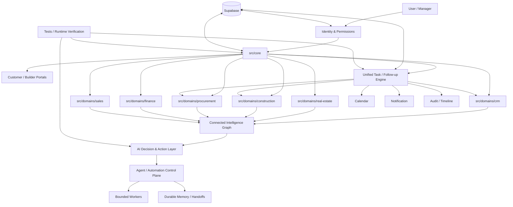

# BuildWise AI — Current Architecture Phase

Updated: 2026-09-27
Branch: architecture/current-phase
Parent: buildwise-implementation

## Purpose
This file is the compact, inspectable architecture map for the current BuildWise phase.
It is intentionally separate from the canonical Master Checklist v3 acceptance register.

Architecture decides structure.
Master Checklist decides acceptance.
STATE/SUMMARY decide execution state.

## Consolidated decisions carried forward

1. BuildWise AI is a Real Estate Operating System (REOS), not a simple CRM.
2. The system is one connected graph across Person, Property, Lead, Deal, Project, Unit, Contract, Money, Task, Document, Schedule and Procurement.
3. Product direction remains: People → Property → Lead → Search → Matching → Deal → Project → Cost/Progress → AI.
4. Core domains remain separated by bounded responsibility; shared infrastructure belongs in src/core/.
5. AI sits across the system; ChatGPT is the architecture/operator layer, while workers are bounded implementation/review executors.
6. .agent-control/ is the durable coordination and decision memory. Never replay the full conversation history.
7. GitHub is code truth; Supabase is live runtime truth; Master Checklist is acceptance truth; runtime evidence beats documentation claims.
8. n8n is optional and never a hard dependency.
9. New features must not be added to legacy duplicate root files.
10. No item is DONE without implementation, tests, runtime evidence, UI evidence where applicable, and security verification where applicable.
11. The coordination loop is: Decision → Task → bounded scope → implementation/review → test → evidence → state update → next task.
12. External worker status is evidence-based; documentation alone does not make a worker live.

## Current architecture map



## Current implementation phase

### Phase A — Architecture / Control-Plane Baseline
The architecture baseline is established and tracked in .agent-control/.
Current objective: preserve consolidated architecture; make decisions inspectable; prevent duplicate implementation; define bounded implementation slices; keep worker context small and reproducible.

### Next implementation slice — Unified Task Engine
This is the next cross-domain capability to implement, not three separate task systems.

One engine:
Task → Assignment → Calendar → Notification → Response → Completion → Audit

Three contexts:
1. CRM / File / Customer follow-up
2. Construction / Workshop follow-up
3. Procurement / Purchasing follow-up

### Task data contract

Minimum fields:
- id
- title / subject
- description
- context_type: crm | construction | procurement
- subject_type: deal | construction | purchase
- related_entity_id
- created_by
- assigned_to
- delegated_by
- scheduled_date
- scheduled_time
- deadline
- recurrence
- priority: critical | important | normal | low
- starred
- status: open | in_progress | completed | rejected | overdue
- response: yes | no | null
- completed_at
- moved_to_date
- notification_enabled
- reminder_at
- notification_status
- created_at / updated_at

### Required behavior
Manager or authorized user can create a task, assign it to a person, put it on that person's calendar, set date/time/deadline, set priority, star/promote it, add a description, and enable notification/reminder.
Assigned user can see today's tasks, receive in-app/push notification when supported, open the task detail page, answer Yes/No, tick complete, move the task to tomorrow, and leave an auditable response.
Tasks remain linked to Person / Property / Lead / Deal / Project / WBS / Purchase / Supplier.

## Separation rule
The UI may expose three operational views, but they share one engine.

```text
                 Unified Task Engine
                        |
          +-------------+-------------+
          |             |             |
        CRM        Construction   Procurement
     File/Customer   Workshop       Purchase
          |             |             |
       Deal/Person    Project/WBS   Material/Supplier
```

Do not create three independent task tables, three independent notification engines, or three independent calendar implementations.

## Calendar model
Calendar is organizational, not only personal.
Manager: Create → Assign → Date/Time → Notify.
User: Today → Task → Respond → Complete / Move to Tomorrow.
Required views: Personal calendar, Manager/team calendar, Daily task list, Overdue list, Starred/priority list.

## Notification model
Notification is a first-class capability, not a visual-only field.
Channels: in-app; push when runtime/platform support is available.
Events: task assigned, reminder due, task due today, task overdue, manager escalation.
Every notification should be auditable.

## Priority vs Promotion
Priority: Critical / Important / Normal / Low.
Promotion: Starred / highlighted.
A low-priority task may still be starred.

## Traceability
- .agent-control/SUMMARY.md — orientation
- .agent-control/MASTER-ARCHITECTURE.md — mother architecture
- .agent-control/PHASE-CURRENT-ARCHITECTURE.md — current architecture phase
- .agent-control/DECISIONS.md — durable decision ledger
- .agent-control/STATE.md — live execution state
- docs/PHASES/ — implementation-phase scope
- Master Checklist v3 — acceptance truth

## Change protocol
Any future architecture decision must update this file if structure changes; add a dated entry to .agent-control/DECISIONS.md; add one short ledger entry to .agent-control/SUMMARY.md; create/update a bounded implementation task; map acceptance only to `.agent-control/MASTER-CHECKLIST-v3-850.md`; never silently replace an existing decision.

## Current non-goals
Do not rebuild the application from scratch; replace the existing CRM; introduce a second architecture; make n8n mandatory; declare external workers live without runtime evidence; or move business logic back into legacy root files.

## Definition of Done for this architecture phase
- Architecture document committed to GitHub.
- Decision ledger committed.
- Master architecture updated.
- Summary updated.
- Current branch inspectable independently.
- No production code changed by this architecture-only phase.

## Customer Experience C01–C40 — canonical implementation layer (2026-10-02)

Customer Experience is a cross-domain capability inside the existing REOS architecture, not a second application.

Flow:
LOGIN → AI ENTRY → REQUIREMENT/PROFILE → INTENT → MARKET/LOCATION → MATCH → FOUR OPTIONS → COMPARE → PROJECT/UNIT → PRICE RANGE/ROI/SCENARIO → REQUEST VISIT → CALENDAR → VISIT → VERIFIED RATING → ADVISOR/DEAL.

Canonical ownership:
- Identity/authentication: existing AUTH / CRM identity boundary.
- AI entry, field fill, intent and routing: existing AI Field/Decision layers.
- Property/land/project/unit: existing canonical domains.
- Price/ROI/scenario/comparable evidence: existing intelligence/finance engines.
- Visit/calendar/notification: existing appointment/task/notification boundaries.
- Ratings/verified reviews/market score: customer-experience persistence added by the C01–C40 migration; no duplicate learning loop.
- Privacy/masking/internal-data firewall: existing security_field_policies + RLS + customer-safe output contract.

Customer-facing invariants:
- Maximum four location recommendations.
- Customer price output is a range capped at ±5% around the supported estimate.
- Exact internal price, owner phone/address, internal notes, negotiations and sensitive calculations are never customer-facing.
- Ratings require a verified interaction and one rating per interaction/rating-kind.
- Public rating aggregation uses verified interactions only.
- Customer media is permission-aware.

Implementation task:
.agent-control/tasks/TASK-CUSTOMER-EXPERIENCE-C01-C40.md

Persistence:
supabase/migrations/20261002230000_customer_experience_c01_c40.sql

Runtime code:
src/domains/portal/customer-experience.js
supabase/functions/customer-portal/index.ts

Acceptance:
C01–C40 remain PARTIAL until focused tests, full CI, live Supabase migration/runtime, browser/UI and applicable security evidence are all verified.